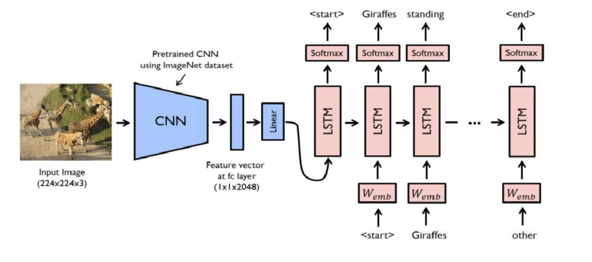

# 🖼️ Image Captioning

A Python-based image captioning project supporting multiple architectures:

- **CNN + LSTM**  
- **Attention-based CNN + LSTM**  
- **CNN + Transformer**  

Includes a Streamlit front-end (`main.py`) for interactive caption generation.

---

## 📁 Repository Structure

```
.
├── SampleImages
├── attention_cnn_lstm
    └── attention_cnn_lstm_model.py
├── cnn_lstm_model
    ├── cnn_lstm_model.py
    └── image-captioning-hyperparameter-tuning-mlflow.ipynb                
├── cnn_transformer_model
    └── cnn_transformer_model.py   
├── main.py                                     
└── requirements.txt 
```

---

## 🚀 Installation

1. Clone the repo:

```bash
git clone https://github.com/Dysfunctional-Human/ImageCaptioning.git
cd ImageCaptioning
```

2. Create a virtual environment and install dependencies:

```bash
python3 -m venv venv
source venv/bin/activate      # On Windows: venv\Scripts\activate
pip install --upgrade pip
pip install -r requirements.txt
```

3. (Optional) Download any required pretrained models or data:
   - Make sure to include the Flickr8k dataset or your own image–caption dataset.
   - Modify paths in `main.py` as needed.

---

## 🛠️ Usage

To run the Streamlit app:

```bash
streamlit run main.py
```

In the app, you can:

- Upload an image
- Select one of the three available architectures:
  - **CNN + LSTM**
  - **Attention CNN + LSTM**
  - **CNN + Transformer**
- View the generated caption

---

## 📝 Module Overviews

### `cnn_lstm_model.py`

- **Vocabulary**  
  Builds token-to-index mappings using `spaCy` tokenizer.  
- **EncoderDecoder**  
  - Encoder: Pretrained ResNet  
  - Decoder: LSTM that generates captions based on image features



---

### `attention_cnn_lstm_model.py`

- **Vocabulary**  
  Similar to the base model, includes frequency thresholding.  
- **EncoderDecoderUsingAttention**  
  - Adds attention mechanism over CNN spatial feature maps  
  - Weights feature regions dynamically during caption generation


---

### `cnn_transformer_model.py`

- **ImageEncoder**  
  Extracts features using ResNet-50 `layer4`.  
- **PositionalEncoding**  
  Implements standard sinusoidal positional encodings.  
- **ImageCaptioningTransformerArchitecture**  
  - Transformer decoder to generate captions  
  - Inference via greedy decoding


---

### `main.py`

- Streamlit UI for inference
- Handles:
  - Image upload
  - Model selection
  - Preprocessing
  - Caption generation
- Supports CUDA if available

---

## ⚙️ Configuration

- **Device**: Set `device = 'cuda'` or `'cpu'` in `main.py`
- **Hyperparameters**: Defined inside each model file (can be externalized)
- **Paths**: Update image/caption paths and model checkpoints as needed

---

## 📦 Requirements

```bash
pip install -r requirements.txt
```

---

## 🚧 Future Work

- ✅ Add training loops for each model architecture  
- ✅ Include model checkpointing  
- ✅ Evaluate using BLEU / METEOR scores  

---

## 📜 License

This project is open-source. Feel free to fork, modify, and build upon it!
## ✨ Acknowledgements

- PyTorch
- Streamlit
- spaCy
- Flickr8k Dataset
```
